---
name: Antigravity-Manager
description: Antigravity Tools 🚀
---

# Antigravity-Manager


# Antigravity Tools 🚀
> 专业级 AI 账号管理与协议代理系统 (v4.7.8)

<div align="center">
  
  <h3>Antigravity Tools</h3>
  <p>多平台自动化运维与多账号矩阵调度控制台</p>

  <p>
    <a href="https://github.com/lbjlaq/Antigravity-Manager/releases">
      
    </a>
    <a href="https://github.com/lbjlaq/Antigravity-Manager">
      
    </a>
    
    
  </p>

  <a href="https://trendshift.io/repositories/18224?utm_source=repository-badge&utm_medium=badge&utm_campaign=badge-repository-18224" target="_blank" rel="noopener noreferrer">
    
  </a>

  <p>
    <a href="#-核心功能">核心功能</a> • 
    <a href="#-界面导览">界面导览</a> • 
    <a href="#-技术架构">技术架构</a> • 
    <a href="#-安装指南">安装指南</a> • 
    <a href="#-快速接入">快速接入</a>
  </p>

  <p>
    <strong>简体中文</strong> | 
    <a href="./README_EN.md">English</a>
  </p>
</div>

---

**Antigravity Tools** 是一个专为开发者和 AI 爱好者设计的全功能桌面应用。它将多账号管理、协议转换和智能请求调度完美结合，为您提供一个稳定、极速且成本低廉的 **本地 AI 中转站**。

通过本应用，您可以将常见的 Web 端 Session (Google/Anthropic) 转化为标准化的 API 接口，消除不同厂商间的协议鸿沟。

## 💖 赞助商 (Sponsors)

| 赞助商 (Sponsor) | 简介 (Description) |
| :---: | :--- |
|  | 感谢 **PackyCode** 对本项目的赞助！PackyCode 是一家可靠高效的 API 中转服务商，提供 Claude Code、Codex、Gemini 等多种服务的中转。PackyCode 为本项目的用户提供了特别优惠：使用[此链接](https://www.packyapi.com/register?aff=Ctrler)注册，并在充值时输入 **“Ctrler”** 优惠码即可享受 **九折优惠**。 |
|  | 感谢 APIKEY.FUN 赞助本项目！APIKEY.FUN 是一家专业的企业级 AI 中转站，致力于为企业和个人开发者提供稳定、高效、低成本的 AI 模型 API 接入服务。平台支持 Claude、OpenAI、Gemini 等主流热门模型，价格低至官方原价的 7%。通过本项目[专属链接](https://apikey.fan/register?aff=Ctrler)注册，还可享受最高 **充值永久 95 折** 专属优惠。 |
|  | 感谢 **Claude API** 对本项目的支持！claudeapi.com 是一家走**官方与 AWS 渠道**接入的 **Claude API** 中转站，专注 Claude，主打高稳定、低延迟，完整支持 Claude Code。为本项目用户提供专属福利：通过[专属链接](https://console.claudeapi.com/register?source=antigravity)注册即送**免费测试额度，零门槛跑通**；充值再享 **95 折**专属优惠(联系客服）。 |
|  | 感谢 AICodeMirror 赞助了本项目！AICodeMirror 提供 Claude Code / Codex / Gemini CLI 官方高稳定中转服务，支持企业级高并发、极速开票、7×24 专属技术支持。 Claude Code / Codex / Gemini 官方渠道低至 3.8 / 0.2 / 0.9 折，充值更有折上折！AICodeMirror 为 Antigravity-Manager 的用户提供了特别福利，通过[此链接](https://aicodemirror.ai/register?invitecode=MV5XUM)注册的用户，可享受首充8折，企业客户最高可享 7.5 折！ |


### ☕ 支持项目 (Support)

如果您觉得本项目对您有所帮助，欢迎打赏作者！

<a href="https://www.buymeacoffee.com/Ctrler" target="_blank"></a>

| 支付宝 (Alipay) | 微信支付 (WeChat) | Buy Me a Coffee |
| :---: | :---: | :---: |
|  |  |  |

## 🚀 推荐项目 (Recommended Projects)

如果您喜欢本项目，可能也会对以下项目感兴趣：

*   **[Antigravity-Tools-LS](https://github.com/lbjlaq/Antigravity-Tools-LS)**: 专为 AI 协议设计的语言服务器 (LSP)，为您提供更智能的代码补全、诊断和协议调试体验。

## 🌟 深度功能解析 (Detailed Features)

### 1. 🎛️ 智能账号仪表盘 (Smart Dashboard)
*   **全局实时监控**: 一眼洞察所有账号的健康状况，包括 Gemini Pro、Gemini Flash、Claude 以及 Gemini 绘图的 **平均剩余配额**。
*   **最佳账号推荐 (Smart Recommendation)**: 系统会根据当前所有账号的配额冗余度，实时算法筛选并推荐“最佳账号”，支持 **一键切换**。
*   **活跃账号快照**: 直观显示当前活跃账号的具体配额百分比及最后同步时间。

### 2. 🔐 强大的账号管家 (Account Management)
*   **OAuth 2.0 授权（自动/手动）**: 添加账号时会提前生成可复制的授权链接，支持在任意浏览器完成授权；回调成功后应用会自动完成并保存（必要时可点击“我已授权，继续”手动收尾）。
*   **多维度导入**: 支持单条 Token 录入、JSON 批量导入（如来自其他工具的备份），以及从 V1 旧版本数据库自动热迁移。
*   **网关级视图**: 支持“列表”与“网格”双视图切换。提供 403 封禁检测，自动标注并跳过权限异常的账号。

### 3. 🔌 协议转换与中继 (API Proxy)
*   **全协议适配 (Multi-Sink)**:
    *   **OpenAI 格式**: 提供 `/v1/chat/completions` 端点，兼容 99% 的现有 AI 应用。
    *   **Anthropic 格式**: 提供原生 `/v1/messages` 接口，支持 **Claude Code CLI** 的全功能（如思思维链、系统提示词）。
    *   **Gemini 格式**: 支持 Google 官方 SDK 直接调用。
*   **智能状态自愈**: 当请求遇到 `429 (Too Many Requests)` 或 `401 (Expire)` 时，后端会毫秒级触发 **自动重试与静默轮换**，确保业务不中断。

### 4. 🔀 模型路由中心 (Model Router)
*   **系列化映射**: 您可以将复杂的原始模型 ID 归类到“规格家族”（如将所有 GPT-4 请求统一路由到 `gemini-3-pro-high`）。
*   **专家级重定向**: 支持自定义正则表达式级模型映射，精准控制每一个请求的落地模型。
*   **智能分级路由 (Tiered Routing)**: [新] 系统根据账号类型（Ultra/Pro/Free）和配额重置频率自动优先级排序，优先消耗高速重置账号，确保高频调用下的服务稳定性。
*   **后台任务静默降级**: [新] 自动识别 Claude CLI 等工具生成的后台请求（如标题生成），智能重定向至 Flash 模型，保护高级模型配额不被浪费。

### 5. 🎨 多模态与 Imagen 3 支持
*   **高级画质控制**: 支持通过 OpenAI `size` (如 `1024x1024`, `16:9`) 参数自动映射到 Imagen 3 的相应规格。
*   **超强 Body 支持**: 后端支持高达 **100MB** (可配置) 的 Payload，处理 4K 高清图识别绰绰有余。

## 📸 界面导览 (GUI Overview)

| | |
| :---: | :---: |
|  <br> 仪表盘 |  <br> 账号列表 |
|  <br> 关于页面 |  <br> API 反代 |
|  <br> 系统设置 | |

### 💡 使用案例 (Usage Examples)

| | |
| :---: | :---: |
|  <br> Claude Code 联网搜索 |  <br> Cherry Studio 深度集成 |
|  <br> Imagen 3 高级绘图 |  <br> Kilo Code 接入 |

## 🏗️ 技术架构 (Architecture)

```mermaid
graph TD
    Client([外部应用: Claude Code/NextChat]) -->|OpenAI/Anthropic| Gateway[Antigravity Axum Server]
    Gateway --> Middleware[中间件: 鉴权/限流/日志]
    Middleware --> Router[Model Router: ID 映射]
    Router --> Dispatcher[账号分发器: 轮询/权重]
    Dispatcher --> Mapper[协议转换器: Request Mapper]
    Mapper --> Upstream[上游请求: Google/Anthropic API]
    Upstream --> ResponseMapper[响应转换器: Response Mapper]
    ResponseMapper --> Client
```



##  安装指南 (Installation)

### 选项 A: 终端安装 (推荐)

#### 跨平台一键安装脚本

自动检测操作系统、架构和包管理器，一条命令完成下载与安装。

**Linux / macOS:**
```bash
curl -fsSL https://raw.githubusercontent.com/lbjlaq/Antigravity-Manager/main/install.sh | bash
```

**Windows (PowerShell):**
```powershell
irm https://raw.githubusercontent.com/lbjlaq/Antigravity-Manager/main/install.ps1 | iex
```

> **支持的格式**: Linux (`.deb` / `.rpm` / `.AppImage`) | macOS (`.dmg`) | Windows (NSIS `.exe`)
>
> **高级用法**: 安装指定版本 `curl -fsSL https://raw.githubusercontent.com/lbjlaq/Antigravity-Manager/main/install.sh | bash -s -- --version 4.6.8`，预览模式 `curl -fsSL https://raw.githubusercontent.com/lbjlaq/Antigravity-Manager/main/install.sh | bash -s -- --dry-run`

#### macOS - Homebrew
如果您已安装 [Homebrew](https://brew.sh/)，也可以通过以下命令安装：

```bash
# 1. 订阅本仓库的 Tap
brew tap lbjlaq/antigravity-manager https://github.com/lbjlaq/Antigravity-Manager

# 2. 安装应用
brew install --cask antigravity-tools
```

#### Arch Linux
您可以选择通过一键安装脚本或 Homebrew 进行安装：

**方式 1：一键安装脚本 (推荐)**
```bash
curl -sSL https://raw.githubusercontent.com/lbjlaq/Antigravity-Manager/main/deploy/arch/install.sh | bash
```

**方式 2：通过 Homebrew** (如果您已安装 [Linuxbrew](https://sh.brew.sh/))
```bash
brew tap lbjlaq/antigravity-manager https://github.com/lbjlaq/Antigravity-Manager
brew install --cask antigravity-tools
```

#### 其他 Linux 发行版
安装后会自动将 AppImage 添加到二进制路径并配置可执行权限。

### 选项 B: 手动下载
前往 [GitHub Releases](https://github.com/lbjlaq/Antigravity-Manager/releases) 下载对应系统的包：
*   **macOS**: `.dmg` (支持 Apple Silicon & Intel)
*   **Windows**: `.msi` 或 便携版 `.zip`
*   **Linux**: `.deb` 或 `AppImage`

### 选项 C: Docker 部署 (推荐用于 NAS/服务器)
如果您希望在容器化环境中运行，我们提供了原生的 Docker 镜像。该镜像内置了对 v4.0.2 原生 Headless 架构的支持，可自动托管前端静态资源，并通过浏览器直接进行管理。

```bash
# 方式 1: 直接运行 (推荐)
# - API_KEY: 必填。用于所有协议的 AI 请求鉴定。
# - WEB_PASSWORD: 可选。用于管理后台登录。若不设置则默认使用 API_KEY。
docker run -d --name antigravity-manager \
  -p 8045:8045 \
  -e API_KEY=sk-your-api-key \
  -e WEB_PASSWORD=your-login-password \
  -e ABV_MAX_BODY_SIZE=104857600 \
  -v ~/.antigravity_tools:/root/.antigravity_tools \
  lbjlaq/antigravity-manager:latest

# 忘记密钥？执行 docker logs antigravity-manager 或 grep -E '"api_key"|"admin_password"' ~/.antigravity_tools/gui_config.json

#### 🔐 鉴权逻辑说明
*   **场景 A：仅设置了 `API_KEY`**
    - **Web 登录**：使用 `API_KEY` 进入后台。
    - **API 调用**：使用 `API_KEY` 进行 AI 请求鉴权。
*   **场景 B：同时设置了 `API_KEY` 和 `WEB_PASSWORD` (推荐)**
    - **Web 登录**：**必须**使用 `WEB_PASSWORD`，使用 API Key 将被拒绝（更安全）。
    - **API 调用**：统一使用 `API_KEY`。这样您可以将 API Key 分发给成员，而保留密码仅供管理员使用。

#### 🆙 旧版本升级指引
如果您是从 v4.0.1 及更早版本升级，系统默认未设置 `WEB_PASSWORD`。您可以通过以下任一方式设置：
1.  **Web UI 界面 (推荐)**：使用原有 `API_KEY` 登录后，在 **API 反代设置** 页面手动设置并保存。新密码将持久化存储在 `gui_config.json` 中。
2.  **环境变量 (Docker)**：在启动容器时增加 `-e WEB_PASSWORD=您的新密码`。**注意：环境变量具有最高优先级，将覆盖 UI 中的任何修改。**
3.  **配置文件 (持久化)**：直接修改 `~/.antigravity_tools/gui_config.json`，在 `proxy` 对象中修改或添加 `"admin_password": "您的新密码"` 字段。
    - *注：`WEB_PASSWORD` 是环境变量名，`admin_password` 是配置文件中的 JSON 键名。*

> [!TIP]
> **密码优先级逻辑 (Priority)**:
> - **第一优先级 (环境变量)**: `ABV_WEB_PASSWORD` 或 `WEB_PASSWORD`。只要设置了环境变量，系统将始终使用它。
> - **第二优先级 (配置文件)**: `gui_config.json` 中的 `admin_password` 字段。UI 的“保存”操作会更新此值。
> - **保底回退 (向后兼容)**: 若上述均未设置，则回退使用 `API_KEY` 作为登录密码。

# 方式 2: 使用 Docker Compose
# 1. 进入项目的 docker 目录
cd docker
# 2. 启动服务
docker compose up -d
```
> **日志轮转**: Compose 默认将 JSON 日志限制为单文件 `100m`、保留 `3` 个文件，避免日志无限增长。
> **访问地址**: `http://localhost:8045` (管理后台) | `http://localhost:8045/v1` (API Base)
> **系统要求**:
> - **内存**: 建议 **1GB** (最小 256MB)。
> - **持久化**: 需挂载 `/root/.antigravity_tools` 以保存数据。
> - **架构**: 支持 x86_64 和 ARM64。
> **详情见**: [Docker 部署指南 (docker)](./docker/README.md)

---

Copyright © 2024-2026 [lbjlaq](https://github.com/lbjlaq)

<details>
<summary><b>🛠️ 常见问题排查 (Troubleshooting) - 点击展开</b></summary>

#### macOS 提示“应用已损坏，无法打开”？
由于 macOS 的安全机制，非 App Store 下载的应用可能会触发此提示。您可以按照以下步骤快速修复：

1.  **命令行修复** (推荐):
    打开终端，执行以下命令：
    ```bash
    sudo xattr -rd com.apple.quarantine "/Applications/Antigravity Tools.app"
    ```
2.  **Homebrew 安装优势**:
    现在通过 Homebrew (`brew install --cask antigravity-tools`) 安装时，系统会在安装末尾自动执行清理属性的操作，**真正实现开箱即用**。

#### Linux 窗口全黑 / 透明框？
在 niri、Hyprland、Sway 等合成器上，旧版本会因为会话里总有 `DISPLAY` 而强制走 X11，WebKit 主界面可能全黑。请更新到包含该修复的版本；或临时：

```bash
env WEBKIT_DISABLE_DMABUF_RENDERER=1 ANTIGRAVITY_FORCE_WAYLAND=1 antigravity-tools
```

- `ANTIGRAVITY_FORCE_WAYLAND=1`: 保持原生 Wayland（不强制切 X11）
- `ANTIGRAVITY_FORCE_X11=1`: 仍需走 X11 时强制启用
- `WEBKIT_DISABLE_DMABUF_RENDERER=1`: 禁用 WebKit DMA-BUF 渲染器

</details>

## 🔌 快速接入示例

### 🔐 OAuth 授权流程（添加账号）
1. 打开“Accounts / 账号” → “添加账号” → “OAuth”。
2. 弹窗会在点击按钮前预生成授权链接；点击链接即可复制到系统剪贴板，然后用你希望的浏览器打开并完成授权。
3. 授权完成后浏览器会打开本地回调页并显示“✅ 授权成功!”。
4. 应用会自动继续完成授权并保存账号；如未自动完成，可点击“我已授权，继续”手动完成。

> 提示：授权链接包含一次性回调端口，请始终使用弹窗里生成的最新链接；如果授权时应用未运行或弹窗已关闭，浏览器可能会提示 `localhost refused connection`。

### 如何接入 Claude Code CLI?
1.  启动 Antigravity，并在“API 反代”页面开启服务。
2.  在终端执行：
```bash
export ANTHROPIC_API_KEY="sk-antigravity"
export ANTHROPIC_BASE_URL="http://127.0.0.1:8045"
claude
```

### 如何接入 OpenCode?
1.  进入 **API 反代**页面 → **外部 Providers** → 点击 **OpenCode Sync** 卡片。
2.  点击 **Sync** 按钮，将自动生成 `~/.config/opencode/opencode.json` 配置文件：
    - 创建独立 provider `antigravity-manager`（不覆盖 google/anthropic 原生配置）
    - 可选：勾选 **Sync accounts** 导出 `antigravity-accounts.json`（plugin-compatible v3 格式），供 OpenCode 插件直接导入
3.  点击 **Clear Config** 可一键清除 Manager 配置并清理 legacy 残留；点击 **Restore** 可从备份恢复。
4.  Windows 用户路径为 `C:\Users\<用户名>\.config\opencode\`（与 `~/.config/opencode` 规则一致）。

**快速验证命令：**
```bash
# 测试 antigravity-manager provider（支持 --variant）
opencode run "test" --model antigravity-manager/claude-sonnet-4-5-thinking --variant high

# 若已安装 opencode-antigravity-auth 插件，验证 google provider 仍可独立工作
opencode run "test" --model google/antigravity-claude-sonnet-4-5-thinking --variant max
```

### 如何接入 Kilo Code?
1.  **协议选择**: 建议优先使用 **Gemini 协议**。
2.  **Base URL**: 填写 `http://127.0.0.1:8045`。
3.  **注意**: 
    - **OpenAI 协议限制**: Kilo Code 在使用 OpenAI 模式时，其请求路径会叠加产生 `/v1/chat/completions/responses` 这种非标准路径，导致 Antigravity 返回 404。因此请务必填入 Base URL 后选择 Gemini 模式。
    - **模型映射**: Kilo Code 中的模型名称可能与 Antigravity 默认设置不一致，如遇到无法连接，请在“模型映射”页面设置自定义映射，并查看**日志文件**进行调试。

### 如何在 Python 中使用?
```python
import openai

client = openai.OpenAI(
    api_key="sk-antigravity",
    base_url="http://127.0.0.1:8045/v1"
)

response = client.chat.completions.create(
    model="gemini-3-flash",
    messages=[{"role": "user", "content": "你好，请自我介绍"}]
)
print(response.choices[0].message.content)
```

### 如何使用图片生成 (Imagen 3)?

#### 方式一：OpenAI Images API (推荐)
```python
import openai

client = openai.OpenAI(
    api_key="sk-antigravity",
    base_url="http://127.0.0.1:8045/v1"
)

# 生成图片
response = client.images.generate(
    model="gemini-3-pro-image",
    prompt="一座未来主义风格的城市，赛博朋克，霓虹灯",
    size="1920x1080",      # 支持任意 WIDTHxHEIGHT 格式，自动计算宽高比
    quality="hd",          # "standard" | "hd" | "medium"
    n=1,
    response_format="b64_json"
)

# 保存图片
import base64
image_data = base64.b64decode(response.data[0].b64_json)
with open("output.png", "wb") as f:
    f.write(image_data)
```

**支持的参数**：
- **`size`**: 任意 `WIDTHxHEIGHT` 格式（如 `1280x720`, `1024x1024`, `1920x1080`），自动计算并映射到标准宽高比（21:9, 16:9, 9:16, 4:3, 3:4, 1:1）
- **`quality`**: 
  - `"hd"` → 4K 分辨率（高质量）
  - `"medium"` → 2K 分辨率（中等质量）
  - `"standard"` → 默认分辨率（标准质量）
- **`n`**: 生成图片数量（1-10）
- **`response_format`**: `"b64_json"` 或 `"url"`（Data URI）

<details>
<summary><b>🎨 展开查看更多图片调用方式与参数映射规则 (Chat API / 模型后缀 / Cherry Studio)</b></summary>

#### 方式二：Chat API + 参数设置 (✨ 新增)

**所有协议**（OpenAI、Claude）的 Chat API 现在都支持直接传递 `size` 和 `quality` 参数：

```python
# OpenAI Chat API
response = client.chat.completions.create(
    model="gemini-3-pro-image",
    size="1920x1080",      # ✅ 支持任意 WIDTHxHEIGHT 格式
    quality="hd",          # ✅ "standard" | "hd" | "medium"
    messages=[{"role": "user", "content": "一座未来主义风格的城市"}]
)
```

```bash
# Claude Messages API
curl -X POST http://127.0.0.1:8045/v1/messages \
  -H "Content-Type: application/json" \
  -H "x-api-key: sk-antigravity" \
  -d '{
    "model": "gemini-3-pro-image",
    "size": "1280x720",
    "quality": "hd",
    "messages": [{"role": "user", "content": "一只可爱的猫咪"}]
  }'
```

**参数优先级**: `imageSize` 参数 > `quality` 参数 > 模型后缀

**✨ 新增 `imageSize` 参数支持**:

除了 `quality` 参数外，现在还支持直接使用 Gemini 原生的 `imageSize` 参数:

```python
# 使用 imageSize 参数(最高优先级)
response = client.chat.completions.create(
    model="gemini-3-pro-image",
    size="16:9",           # 宽高比
    imageSize="4K",        # ✨ 直接指定分辨率: "1K" | "2K" | "4K"
    messages=[{"role": "user", "content": "一座未来主义风格的城市"}]
)
```

```bash
# Claude Messages API 也支持 imageSize
curl -X POST http://127.0.0.1:8045/v1/messages \
  -H "Content-Type: application/json" \
  -H "x-api-key: sk-antigravity" \
  -d '{
    "model": "gemini-3-pro-image",
    "size": "1280x720",
    "imageSize": "4K",
    "messages": [{"role": "user", "content": "一只可爱的猫咪"}]
  }'
```

**参数说明**:
- **`imageSize`**: 直接指定分辨率 (`"1K"` / `"2K"` / `"4K"`)
- **`quality`**: 通过质量等级推断分辨率 (`"standard"` → 1K, `"medium"` → 2K, `"hd"` → 4K)
- **优先级**: 如果同时指定 `imageSize` 和 `quality`, 系统会优先使用 `imageSize`

#### 方式三：Chat 接口 + 模型后缀
```python
response = client.chat.completions.create(
    model="gemini-3-pro-image-16-9-4k",  # 格式：gemini-3-pro-image-[比例]-[质量]
    messages=[{"role": "user", "content": "一座未来主义风格的城市"}]
)
```

**模型后缀说明**：
- **宽高比**: `-16-9`, `-9-16`, `-4-3`, `-3-4`, `-21-9`, `-1-1`
- **质量**: `-4k` (4K), `-2k` (2K), 不加后缀（标准）
- **示例**: `gemini-3-pro-image-16-9-4k` → 16:9 比例 + 4K 分辨率

#### 方式四：Cherry Studio 等客户端设置
在支持 OpenAI 协议的客户端（如 Cherry Studio）中，可以通过**模型设置**页面配置图片生成参数：

1. **进入模型设置**：选择 `gemini-3-pro-image` 模型
2. **配置参数**：
   - **Size (尺寸)**: 输入任意 `WIDTHxHEIGHT` 格式（如 `1920x1080`, `1024x1024`）
   - **Quality (质量)**: 选择 `standard` / `hd` / `medium`
   - **Number (数量)**: 设置生成图片数量（1-10）
3. **发送请求**：直接在对话框中输入图片描述即可

**参数映射规则**：
- `size: "1920x1080"` → 自动计算为 `16:9` 宽高比
- `quality: "hd"` → 映射为 `4K` 分辨率
- `quality: "medium"` → 映射为 `2K` 分辨率

</details>

## 📝 更新日志

> 最新版本 **v4.7.5**（2026-09-18）：完美修复 Agent 客户端 404/429/503 报错，清洗 billing 头杜绝 Google WAF 误判；解除 1000 毒药预算导致思维链归零缺陷并开放至 24576/32768 大预算；重构日志大报文虚拟滚动渲染与内存解耦搜索，建立 30% 滑动窗口容量平滑淘汰；根治 Balance 负载均衡模式 429 故障转移与粘性会话死锁；支持 Windows 原生快捷方式自愈与覆盖安装冲突修复；自动补齐历史 PRO 账号标识。

👉 **[查看完整更新日志 CHANGELOG.md →](CHANGELOG.md)**

<details>
<summary><b>👥 核心贡献者 (Contributors) - 点击展开</b></summary>

<a href="https://github.com/lbjlaq"></a>
<a href="https://github.com/jeikl"></a>
<a href="https://github.com/XinXin622"></a>
<a href="https://github.com/llsenyue"></a>
<a href="https://github.com/salacoste"></a>
<a href="https://github.com/84hero"></a>
<a href="https://github.com/karasungur"></a>
<a href="https://github.com/marovole"></a>
<a href="https://github.com/wanglei8888"></a>
<a href="https://github.com/yinjianhong22-design"></a>
<a href="https://github.com/Mag1cFall"></a>
<a href="https://github.com/AmbitionsXXXV"></a>
<a href="https://github.com/fishheadwithchili"></a>
<a href="https://github.com/ThanhNguyxn"></a>
<a href="https://github.com/Stranmor"></a>
<a href="https://github.com/Jint8888"></a>
<a href="https://github.com/0-don"></a>
<a href="https://github.com/dlukt"></a>
<a href="https://github.com/Silviovespoli"></a>
<a href="https://github.com/i-smile"></a>
<a href="https://github.com/jalen0x"></a>
<a href="https://linux.do/u/wendavid"></a>
<a href="https://github.com/byte-sunlight"></a>
<a href="https://github.com/jlcodes99"></a>
<a href="https://github.com/Vucius"></a>
<a href="https://github.com/Koshikai"></a>
<a href="https://github.com/hakanyalitekin"></a>
<a href="https://github.com/Gok-tug"></a>
<a href="https://github.com/johngbl"></a>

感谢所有为本项目付出汗水与智慧的开发者。

</details>

<details>
<summary><b>🤝 鸣谢项目 (Special Thanks) - 点击展开</b></summary>

本项目在开发过程中参考或借鉴了以下优秀开源项目的思路或代码，排名不分先后：

*   [learn-claude-code](https://github.com/shareAI-lab/learn-claude-code)
*   [Practical-Guide-to-Context-Engineering](https://github.com/WakeUp-Jin/Practical-Guide-to-Context-Engineering)
*   [CLIProxyAPI](https://github.com/router-for-me/CLIProxyAPI)
*   [OmniRoute](https://github.com/diegosouzapw/OmniRoute)
*   [antigravity-claude-proxy](https://github.com/badrisnarayanan/antigravity-claude-proxy)
*   [aistudio-gemini-proxy](https://github.com/zhongruichen/aistudio-gemini-proxy)
*   [gcli2api](https://github.com/su-kaka/gcli2api)
*   [agent-vibes](https://github.com/funny-vibes/agent-vibes)

</details>

*   **版权许可**: 基于 **CC BY-NC-SA 4.0** 许可，**严禁任何形式的商业行为**。
*   **安全声明**: 本应用所有账号数据加密存储于本地 SQLite 数据库，除非开启同步功能，否则数据绝不离开您的设备。

---

<div align="center">
  <p>如果您觉得这个工具有所帮助，欢迎在 GitHub 上点一个 ⭐️</p>
  <p>Copyright © 2025 Antigravity Team.</p>
</div>

