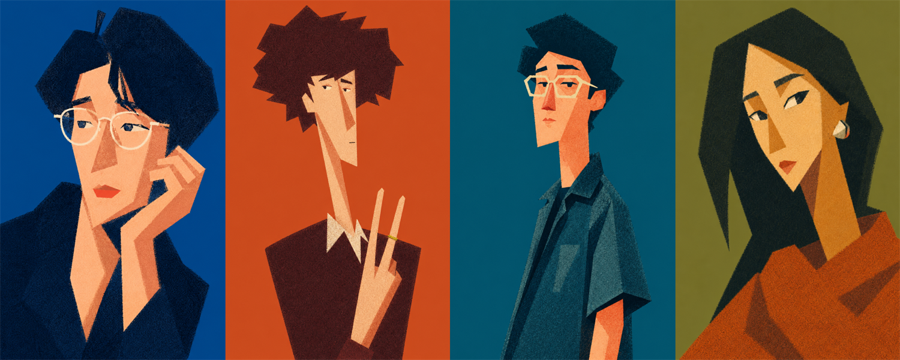

# Grainy Plane Style（颗粒棱面风格）

平涂大色块 + 细密颗粒的图形风格。两种模式共用同一套风格 DNA。

## 风格 DNA（六项，任何主题不变）

1. 细密均匀点状颗粒，如喷漆穿过模板；
2. **颗粒只在主体，背景绝对干净**（单一平涂色，零噪点零纹理）——这是成立条件，不是可选项；
3. 边缘为颗粒侵蚀边：形状硬、可辨、对焦清晰，边界呈细密斑点毛刺；既非光洁矢量线，也非柔化模糊；
4. 少量大棱面，一面一色，面内无色阶切分；
5. 封闭 5–6 色，无渐变，无描边；
6. 剪影第一眼可辨，图形感优先于写实。

第 2 条是最容易丢的一条。多数模型默认会把颗粒铺满整张图，背景一脏，风格立刻塌成"加了噪点的插画"。

## 模式判别

- 用户给了**一张照片**要改风格 → `references/photo-restyle.md`
- 用户要**从零生成**（封面、插图、某个主题的图）→ `references/from-scratch.md`
- 用户要**一份能整段发给别人、对方只填主题就能用的版本** → `ARTICLE-COPY.md`
- 没说清就先问一句，不要默认

## 照片改风格

**已实测定稿，整段复制不改字。** 用户动作三步：传照片 → 粘贴提示词 → 生成。不需要 API，不需要参考图。

- **不走多图风格参考路径**——那需要先备一张参考图，交付物就从提示词变成了那张图。
- **不要"优化"这条提示词**：三次改进实测均劣化并已回退，改动前必读 reference 里的失败记录。
- 换气质只替换 `COLOUR —` 段（九组备选在 reference 里），**其他段落一律不碰**。

## 从零生成

填母版即可：**主体类型 × 配色逻辑 × 机位构图**自由组合。DNA 固定块逐字复用，只换色板。六条参照示例在 `references/examples.md`。

组合前先看 reference 末尾的组合禁忌表——五条里有三条（俯视加透视、亮色多处出现、远景主体过小）不写进提示词就会犯。

**未逐条实测**：DNA 固定块本身在照片改风格模式里已验证，母版和六条示例是按它编译的组合，出图偏差先怀疑 Subject 槽的点名，不要动固定块。

## 提示词书写规则

七段，带段落标签，按此顺序：**Use case / Scene / Subject / Key details / Composition / Text in image / Constraints**。

排除项直接并进 `Constraints` 段，**绝不单独输出成一个负面提示词块**——GPT Image 2 这类模型没有 negative 通道，独立成块的约束只会丢失或被当成正面描述画出来。

每条提示词都要完整、可直接复制，不要把关键约束拆成含糊备注让用户自己拼。

## 已知取舍（属接受项，不要反复修）

| 现象 | 状态 |
|---|---|
| 背景色相偏蓝 | 接受项，不再修。历史见 `references/test-log.md` |
| 脸型趋同（各种脸型都被拉长/变尖） | 接受项，不再修——风格强度优先于脸型还原，修法会削弱造型强度，得不偿失。历史见 `references/test-log.md` |
| 夸张幅度与本人识别度此消彼长 | 接受项。回调时减掉单个操作，不要整体降幅——整体降幅会直接退回写实 |

## Guardrails

- 风格用视觉特征描述，**不指名具体艺术家**。
- **他人照片需本人同意。**
- 正脸平光自拍效果最差，源照有明确单侧光时最稳——可以提醒用户，但不作为必须步骤。
- 出图不满意直接重生成一次，不引导用户做多轮修正（会破坏三步流程）。
